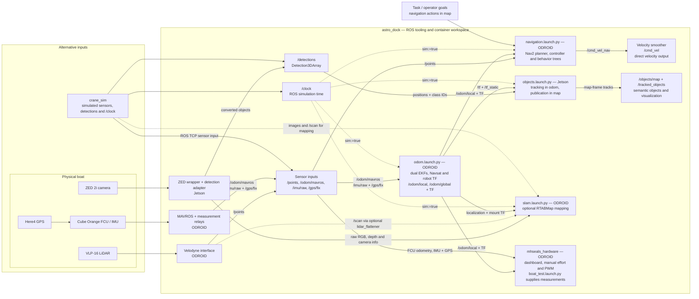

# mhseals_nav

### Overview

This package serves as the core navigation system for the ASV, interacting with the simulation and hardware interfaces established in [`crane_sim`](https://github.com/1unarzDev/crane_sim) and [`mhseals_hardware`](https://github.com/mhseals/mhseals_hardware). It encompasses sensor data fusion, localization, object detection and tracking, task detection, path generation, path following, and velocity outputs.

### Usage

Launch files separate the main responsibilities:

- `robot.launch.py` composes sensors, localization, navigation, and objects. `enable_slam:=true` additionally starts RTABMap mapping; navigation and EKF localization run either way. Generally used for simulation; on the boat, launch components on their respective hosts.
- `sensors.launch.py` starts Velodyne/ZED drivers with `sim:=false`, or the ROS TCP endpoint with `sim:=true`. Use `sensors_ignore:=camera` on ODROID and `sensors_ignore:=lidar` on Jetson.
- `odom.launch.py` starts MAVROS, measurement relays, dual EKFs, Navsat, and robot TF.
- `navigation.launch.py` starts Nav2 servers and lifecycle management. SLAM is optional.
- `slam.launch.py` starts RTABMap mapping, leaving localization TF with the EKFs.
- `objects.launch.py` always tracks `/detections`. With `sim:=false`, it also converts ZED objects into that interface, remapping the adapter input to `objects_topic`. Set `rosbridge_url` and `camera_root_frame` for a legacy ZED host.
- `boat_test.launch.py` provides localization and optional local sensors for the hardware test dashboard.

```bash
ros2 launch mhseals_nav <launch_name>.launch.py param1:=value1 param2:=value2
ros2 launch mhseals_nav robot.launch.py --show-args
ros2 launch mhseals_nav robot.launch.py sim:=true
```

Start each component once. `robot` includes navigation, so running it also starts Nav2. `sim:=true` requires the simulator's `/clock`; use `sim:=false` on the boat.

`/cmd_vel` is the final smoothed navigation output. Nav2 commands are velocity targets; the hardware PWM driver interprets Twist as effort, so autonomous propulsion requires a calibrated velocity controller.

### Parameters

| Parameter | Launch files | Default / purpose |
| --- | --- | --- |
| `sim` | `robot`, `sensors`, `odom`, `navigation`, `slam`, `objects` | `true`; simulation time requires `/clock`. In `objects`, also selects simulated detections rather than ZED input |
| `use_lidar` | `robot`, `navigation` | `true`; require `/points` for obstacle avoidance. `false` disables both obstacle layers for supervised testing; cameras do not replace them |
| `sensors_ignore` | `robot`, `sensors`, `boat_test` | Empty except `boat_test` (`camera`); comma-separated local drivers to skip, e.g. `camera,lidar`. Does not disable Nav2 obstacle layers |
| `enable_slam` | `robot` | `false`; include `slam.launch.py` for RTABMap mapping. Requires images and `/scan`; does not change Nav2 or EKF localization |
| `fcu_url` | `robot`, `odom`, `boat_test` | Required for `boat_test`; otherwise empty selects SITL TCP in simulation or `/dev/ttyACM0` at 57600 baud on hardware |
| `camera_name` | `robot`, `sensors`, `odom`, `slam` | `front`; camera namespace and topic prefix |
| `detections_topic`, `objects_topic` | `objects` | `/detections`, `/front/zed_node/obj_det/objects`; tracker input and ZED source |
| `rosbridge_url`, `camera_root_frame` | `objects` | Empty; with `sim:=false`, select legacy transport and its calibrated camera subtree root |
| `start_sensors` | `boat_test` | `false`; also start local drivers, respecting `sensors_ignore` |

Configuration paths, device addresses, and rate overrides are listed by `ros2 launch mhseals_nav <launch_name>.launch.py --show-args`. Keeping `use_lidar:=true` while skipping the local driver allows another host or simulator to supply `/points`. Disabling LiDAR is explicit; stale data never triggers an automatic fallback.

### Architecture

[`astro_dock`](https://github.com/1unarzDev/astro_dock) provides the ROS tooling and container workspace for these components. Simulation and hardware producers satisfy the interfaces below.




Required interfaces depend on which components are running:

| Consumer | Required topics / interfaces |
| --- | --- |
| Localization | `/odom/mavros` (`Odometry`, body velocity), `/imu/raw` (`Imu`, FCU heading/yaw rate), `/gps/fix` (`NavSatFix`) |
| Navigation | `/odom/local` (`Odometry`), `/points` (`PointCloud2`, when `use_lidar:=true`), navigation action goals in `map` |
| Object tracking | `/detections` (`Detection3DArray`, metres, acquisition timestamps, actual source frame, labels in `results[].hypothesis.class_id`) |
| Optional SLAM | `/front_camera/rgb/image` (`Image`), `/front_camera/depth/image` (`Image`), `/front_camera/camera_info` (`CameraInfo`), `/scan` (`LaserScan`); camera prefix follows `camera_name` |
| Simulation | `/clock`, plus the inputs required by the enabled components |

Navigation and tracking also require `/tf` and `/tf_static` with `map → odom → base_link → sensor` connectivity. The global EKF owns `map → odom`, the local EKF owns `odom → base_link`, and the robot description owns sensor mounts. Preserve measurement frame IDs and timestamps, and synchronize clocks across hosts. `/imu/raw` is the legacy name for FCU-fused MAVROS `/imu/data`, rather than `/imu/data_raw`.

Navigation uses Regulated Pure Pursuit with rolling costmaps. Object tracks are separate from collision avoidance. Optional SLAM needs raw RGB images; supply/remap a raw stream because the sensor RGB relay carries compressed images.

### Boat tests

The test launch supplies measurements; the [`mhseals_hardware` dashboard](https://github.com/mhseals/mhseals_hardware/blob/main/docs/boat-test.md) owns monitoring, recording, and confirmed physical tests.

```bash
# Terminal 1 on ODROID; camera remains on Jetson.
ros2 launch mhseals_nav boat_test.launch.py \
  fcu_url:=serial:///dev/ttyACM0:57600 start_sensors:=true

# Terminal 2: monitor the running stack.
ros2 run mhseals_hardware boat_test --monitor-only
```

The dashboard can instead start the measurements with `--start-stack --fcu-url serial:///dev/ttyACM0:57600`; `--optional-sensors` adds local LiDAR and `--record` adds bags. Choose one startup path. For physical tests, omit `--monitor-only`, stop other actuator controllers, and secure the boat/clear propellers; the dashboard starts disarmed and confirms physical actions.

### Development

Develop inside the [`astro_dock`](https://github.com/1unarzDev/astro_dock) ROS container; its README covers setup and simulation connections. From the workspace root:

```bash
colcon build --symlink-install --packages-select mhseals_nav mhseals_hardware
source install/setup.bash
colcon test --packages-select mhseals_nav mhseals_hardware
colcon test-result --verbose

ros2 node list
ros2 topic hz /odom/local
ros2 topic hz /points
ros2 run tf2_ros tf2_echo map base_link
```

`setup.py` registers `console_scripts` for `ros2 run mhseals_nav <executable>` and installs launch files, configurations, robot descriptions, and behavior trees. Register new runnable nodes there, declare dependencies in `package.xml`, and rebuild/source after installed assets change. Tuning lives in `config/`, physical frames in `description/`, and navigation behavior in `mhseals_nav/behavior_trees/`.

Keep changes lean and scoped. Open a pull request explaining what changed, why, and how it was tested, including any interface changes. Update the README when usage or architecture changes. Run ROS runtime probes in an isolated container/domain without boat hardware.
